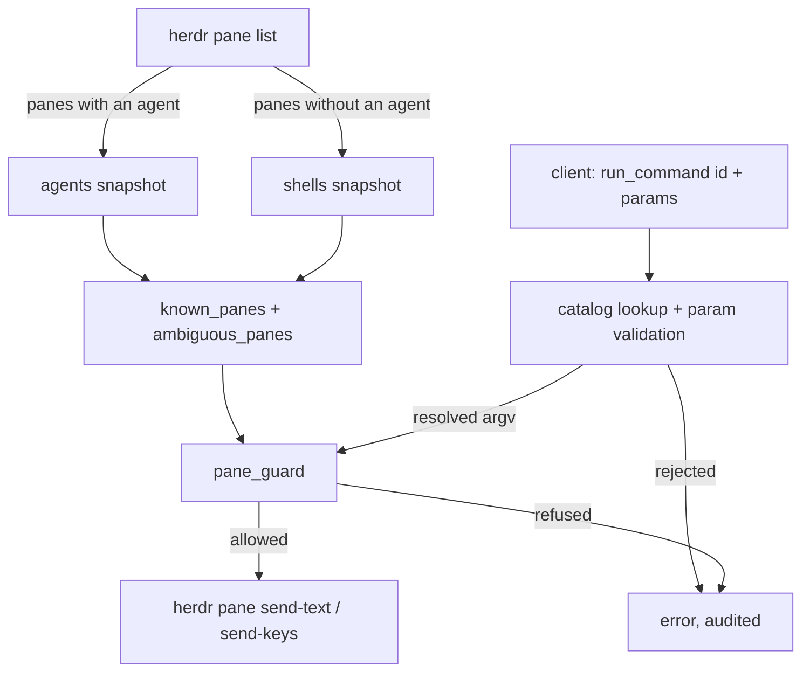

# Architecture Proposal — Terminal Mode

**Date:** 2026-08-09
**Scope:** `relay/herdr_relay.py`, a new `relay/commands.py`, `web/index.html`, a new operator-owned
catalog file.
**Classification:** **Class B** — architectural extension, backward compatible. New message types and
a new poll source. Additive on the wire; existing clients are unaffected.
**Status:** Proposal. §10 lists what must be answered before a spec is written. One of those
questions is a security decision the architect will not make on the user's behalf.

---

## 1. Problem

Every pane herdr knows about is reachable, but only panes *running an agent* are visible. The relay's
snapshot is built from herdr's pane list filtered to `if p.get("agent")` — a plain shell, including
the ones this codebase creates and labels itself as spacers, is dropped before it reaches a client.

So from a phone there is no way to run `git status`, tail a log, restart a dev server, or check why
the agent's build failed. The agent is remote-controllable and the machine it runs on is not.

The ask is not "a web terminal". It is: **a small set of known operations, run on the host, chosen
from a list rather than typed.** That framing is what makes this buildable safely, and §5 is the
whole proposal.

## 2. Proof of Discovery

| Finding | Location | Consequence |
|---|---|---|
| The agent snapshot filters panes to those with an agent | `herdr_relay.py:303` (`for p in panes if p.get("agent")`) | Shell panes are invisible to every client. Root cause |
| `known_panes` is populated only from that snapshot | `herdr_relay.py:614–618` | A shell pane ID is not in the set |
| `pane_guard` refuses any pane not in `known_panes`, and any pane whose ID appears on more than one host | `herdr_relay.py:382–392` | **Every** write path — `respond`, `read_pane`, `send_keys`, `send_text`, `rename_pane`, `set_slot` — already refuses shell panes. Terminal mode is blocked at exactly one function, by design |
| `herdr pane list` is already parsed for non-agent panes | `start_agent.py:312` `claimable_spacer`, `herdr_relay.py:486` `dig_panes` | The second poll source exists and is already trusted for placement decisions |
| Pane IDs are per-server counters and collide across hosts; `ambiguous_pane_ids` exists for this | `herdr_relay.py:382–392`, decision D6 | Shell panes collide identically. Any new pane source must feed the same ambiguity set, not a parallel one |
| `SAFE_RESPONSES` and `SAFE_KEYS` gate `respond` and `send_keys` by allowlist | `herdr_relay.py:872, 915` | The established pattern for "the client may not choose arbitrary content". §5 extends it rather than inventing a scheme |
| `send_text` is capped at 4000 chars and is **not** behind a gate | `herdr_relay.py:932–951` | Load-bearing for §6. Today `send_text` is safe only because `pane_guard` limits its targets to agent panes |
| Projects supply the only cwd allowlist in the system, from an operator-owned file at `HERDR_PROJECTS_FILE` | `relay/projects.py`, start-agent spec §3 | The trust boundary and the file-backed-catalog pattern both already exist. Reuse both |
| `HERDR_ENABLE_WRITE_EXT` gates process creation; `rename_pane` was deliberately left ungated as "strictly weaker" | `herdr_relay.py:952–956, 979–986` | The existing gate reasoning is about *process creation*, and a shell is exactly that. §6 |
| `SHORTCUTS` is a hardcoded client-side array that inserts text at the cursor | `web/index.html:1750` | The wrong home for terminal commands: the client is not a trust boundary |
| `--source visible` reads the live frame with no backlog, and ctrl+l genuinely clears a shell | commit `20a1334` | Shell output needs no new read machinery. `read_pane` works as-is once the guard allows the pane |

**Invariants to preserve**

- `pane_guard` stays the single choke point for pane addressability. Terminal mode extends what it
  knows, and does not route around it.
- Ambiguous pane IDs are refused, never guessed.
- Anything reaching argv is validated against an allowlist, never passed through.
- Every write is audited with the originating ip, device, and listener.
- Existing clients (iOS, macOS, Telegram, TUI) decode the current messages unchanged.

## 3. What terminal mode is, and is not

| In | Out |
|---|---|
| Discovering shell panes on polled hosts and showing them | Any pane on a host the relay does not already poll |
| Reading a shell pane's output (`read_pane`, unchanged) | A PTY stream, xterm.js, or anything resembling a live terminal emulator |
| Running a **catalog** command by id, with validated parameters | Sending client-supplied text to a shell by default |
| An operator-owned catalog file, versioned and reloadable | A catalog the browser can add to |
| Creating a shell pane in a Project cwd | A shell in an arbitrary path |
| Ctrl+C, Ctrl+D, Enter, arrows — the existing `SAFE_KEYS` set | New keys chosen by the client |
| An explicit, separately-gated raw-input escape hatch (§6.3) | That hatch being on by default, or reachable from an unauthenticated listener |

## 4. Data flow



Two things to read off this diagram:

- The shell snapshot joins the *same* `known_panes` and ambiguity sets. Not a parallel registry — a
  second registry would need its own collision guard, and D6 exists because that collision is real.
- A client never names a command string. It names a catalog id. Resolution happens relay-side, after
  which the flow rejoins the existing guarded path.

## 5. Managed input — the core of the proposal

### 5.1 The catalog

An operator-owned JSON file at `HERDR_COMMANDS_FILE`, unset meaning terminal mode is off — the same
shape of switch as `HERDR_PROJECTS_FILE`. It is read by the relay, never written by it, and never
authored by a client.

```json
{
  "version": 1,
  "commands": [
    { "id": "git_status", "label": "git status", "argv": ["git", "status", "--short"] },
    { "id": "tail_log",   "label": "Tail a log",
      "argv": ["tail", "-n", "{lines}", "{file}"],
      "params": [
        { "name": "lines", "type": "int", "min": 10, "max": 500, "default": 100 },
        { "name": "file",  "type": "choice", "choices": ["build.log", "server.log"] }
      ] },
    { "id": "restart_dev", "label": "Restart dev server",
      "argv": ["make", "dev"], "confirm": true }
  ]
}
```

| Field | Rule |
|---|---|
| `id` | Unique. The only command identifier a client ever sends |
| `label` | Display only. Never reaches a shell |
| `argv` | A list, not a string. Placeholders are whole elements or embedded in one element |
| `params` | Typed. `choice` (closed set), `int` (bounded), `text` (regex, bounded length). No free type |
| `confirm` | Client shows a confirmation step. A hint, not a security control — the relay does not rely on it |

**A list and not a string, deliberately.** A command string invites the client to compose one, and
invites the relay to split it. The catalog holds argv elements, parameters substitute into single
elements, and nothing is ever handed to a shell for word-splitting by the relay itself.

Note the honest limit: the substituted argv is joined and sent to an *interactive shell* via
`pane send-text`, so the shell does the final word-splitting. That is what makes parameter validation
load-bearing rather than cosmetic. A `text` parameter with a permissive regex is a shell injection.
The spec must state that regexes are the security boundary and that the default `text` regex is
restrictive — and it should say plainly that a catalog author can write an unsafe entry, in the same
way anyone who can write `HERDR_PROJECTS_FILE` can already point a Project anywhere.

### 5.2 Wire additions

| Direction | Message | Payload |
|---|---|---|
| S→C | `shells` | Shell panes: `pane_id`, `label`, `cwd`, `host`, `workspace_id`, `tab_id`. Sent alongside `agents`, on the same poll |
| S→C | `command_catalog` | Sent on connect when terminal mode is on, exactly as `start_options` is |
| C→S | `run_command` | `pane_id`, `command_id`, `params` — validated, audited, then sent as text plus Enter |
| C→S | `open_terminal` | `project_id`, optional `placement`. Creates or claims a shell pane in the Project's cwd |

All four are additive. A client that does not know them is unaffected; a relay that does not know
them already answers with the "the relay may be older than this client" error added in an earlier
phase, which is exactly the right message here.

`read_pane`, `send_keys`, and `set_slot` need no change — they work on any pane the guard allows.

### 5.3 Reusing what exists

- **Pane creation:** `start_agent_exec` already creates a workspace, a tab, or a split, at a Project
  cwd, with rollback on failure, and already reuses a labelled spacer when one is standing. A shell
  pane is that flow minus the `agent start` step. `open_terminal` is a subset of code that exists and
  is tested — not a new path beside it.
- **Cwd allowlist:** Projects. A terminal opens in a Project's cwd or it does not open. No new
  path-validation code, and no new trust boundary to get wrong.
- **Slots:** a terminal pane is a pane. `set_slot` applies unchanged.
- **Reading:** `read_pane` unchanged, including the `cols` measurement and `--source visible`.

The genuinely new code is: the shell branch of the poll, the catalog loader and validator, and the
frontend surface. Everything else is reuse.

## 6. Security

This section is written plainly on purpose. It is the part of the proposal that must not be skimmed.

### 6.1 What this feature actually is

Terminal mode makes a remote machine's shell reachable from any browser that can open the relay's
WebSocket. Even with a strict catalog, it is remote command execution: the operator chooses which
commands, but the network-reachable surface is a live shell prompt on their machine. Every existing
gate in this system was designed for something weaker than that — `respond` sends one of a fixed set
of approval strings, `send_keys` sends one of a fixed set of keys, and `send_text` is safe only
because `pane_guard` currently limits its targets to panes owned by an agent process.

### 6.2 The recommendation

**A new, separate environment gate: `HERDR_ENABLE_TERMINAL`, defaulting to off.**

Not `HERDR_ENABLE_WRITE_EXT`. That gate's documented reasoning is process creation — starting an
agent, splitting a pane. A user who turned it on to start sessions from their phone did not thereby
consent to a shell. Reusing it would silently widen a permission that hundreds of words in this
repository describe as meaning something narrower.

Three conditions, all required, all enforced at relay startup, and the relay refuses to boot with
terminal mode on and any of them unmet:

1. `HERDR_ENABLE_TERMINAL=1`.
2. `HERDR_COMMANDS_FILE` set and parsing cleanly. No file, no terminal mode — the catalog is the
   feature, not a decoration on it.
3. `HERDR_RELAY_TOKEN` set. **`HERDR_LAN_OPEN=1` must not exempt terminal mode.** An open LAN
   listener is a deliberate convenience for approving agent prompts on a trusted network; it should
   not also hand a shell to anything that can reach that port. If the operator genuinely wants that,
   it needs its own second explicit opt-in, and the spec should treat that as a separate decision
   rather than a flag combination that falls out by accident.

Additionally: `send_text` to a shell pane must be refused unless §6.3 is on, every `run_command` is
audited with the resolved argv alongside the existing ip/device/listener attribution, and a rejected
parameter is logged with the reason.

### 6.3 The raw-input escape hatch

There will be a moment where the catalog does not have the command someone needs. A third setting,
`HERDR_TERMINAL_RAW=1`, off by default and requiring terminal mode already on, permits `send_text` to
shell panes.

State it clearly in the docs: with raw input on, anyone who can reach the relay and hold the token
can run anything the herdr user can run. That is not a reason to omit the hatch — the operator owns
their machine — it is a reason for it to be a separate switch, documented in exactly those words.

### 6.4 What is not proposed

No sudo handling, no credential entry, no per-command user accounts, no attempt to sandbox the shell.
Those would be security theatre over a PTY the relay does not control. The honest boundary is: the
operator decides what the catalog contains and who holds the token.

## 7. Client surface

- Shell panes appear in the agent list under their own section — "Terminals" — with the shell icon
  path the agent-icon detection already has a slot for. Never mixed into the agent groups: a shell
  has no status, and an idle shell rendered as an idle agent is a lie.
- Opening one uses the existing terminal view. The content region, the ruler, the wrap modes, the
  scroll, the CLS control, and the slot control are unchanged.
- The composer is replaced by a **command grid** rendered from `command_catalog`: one button per
  command, a parameter sheet for commands that take them, a confirmation step where `confirm` is
  set. The keys pad stays — Ctrl+C on a runaway process is the single most valuable control here.
- The free-text input is absent unless the relay advertised raw input, following the same
  presence-is-the-feature-gate pattern that `start_options` established.
- Pairs, transfer, and the started-session flow do not apply to shells and are not rendered.

## 8. Phasing

| Phase | Delivers | Gate |
|---|---|---|
| T1 | Shell panes in the snapshot, in the guard, and in the list. Read-only | `HERDR_ENABLE_TERMINAL` |
| T2 | Catalog file, `command_catalog`, `run_command`, the command grid | + `HERDR_COMMANDS_FILE` |
| T3 | `open_terminal` — creating a shell in a Project cwd | + `HERDR_ENABLE_WRITE_EXT` |
| T4 | Raw input | + `HERDR_TERMINAL_RAW` |

T1 is independently useful — seeing what is running on the box, and Ctrl+C — and it is the phase that
proves the ambiguity guard holds for shell panes before anything can write to one.

## 9. Risks

| Risk | Mitigation |
|---|---|
| Shell pane IDs collide across hosts exactly as agent IDs do | Feed the same `ambiguous_panes` set. Non-negotiable; the guard is one function for this reason |
| A shell pane's ID is reused after the pane closes | The pair spec's fingerprint problem, one layer down. A terminal pane's identity should carry `cwd` + `host` + `label`, and a mismatch closes the view rather than writing into a stranger |
| Catalog reload while a client holds an old catalog | Version the catalog; reject a `run_command` whose `command_id` is unknown — which the lookup does anyway |
| Poll cost of a second `pane list` per host | It is one call per host per poll, and `claimable_spacer` already makes a similar call on the start path. Measure, do not assume |
| A long-running command with no output | Terminal mode reads a pane; it does not track process lifetime. Say so in the UI rather than inventing a completion signal herdr does not expose |
| Feature creep into a web terminal | §3's out-column is binding. If a spec proposes a PTY stream, it is a different feature with a different classification |

## 10. Open questions — must be answered before the spec

1. **The `HERDR_LAN_OPEN` interaction (§6.2, condition 3).** The recommendation is that an open LAN
   listener never carries terminal mode. This is a real ergonomic cost on a home network and it is
   the user's call, not the architect's. It must be answered explicitly, in writing, before T1.
2. **Is T4 wanted at all?** If raw input is the actual goal, the catalog is scaffolding around a
   feature that could be four lines, and the proposal should be re-cut honestly around that.
   If the catalog is the goal, T4 may never ship.
3. **Where does the catalog live per host?** One relay-side catalog, or per-Project catalogs keyed by
   `project_id`? Per-Project is more useful — `make dev` means something different per repo — and it
   is more file plumbing. Recommend per-Project, with a shared global section.
4. **Does a command run in the pane, or in a fresh one?** Running in the user's pane inherits their
   shell state, which is usually what is wanted and is also how a half-typed command line gets
   mangled. Recommend: refuse to send when the pane's last line is not a clean prompt, which needs a
   prompt-detection heuristic and therefore needs a decision about how wrong it is allowed to be.
5. **Should Telegram, iOS, and macOS get this?** They ignore the new messages today, which is correct
   and requires no work. Extending terminal mode to a Telegram chat is a materially larger
   authorization question than extending it to a browser holding a token.
