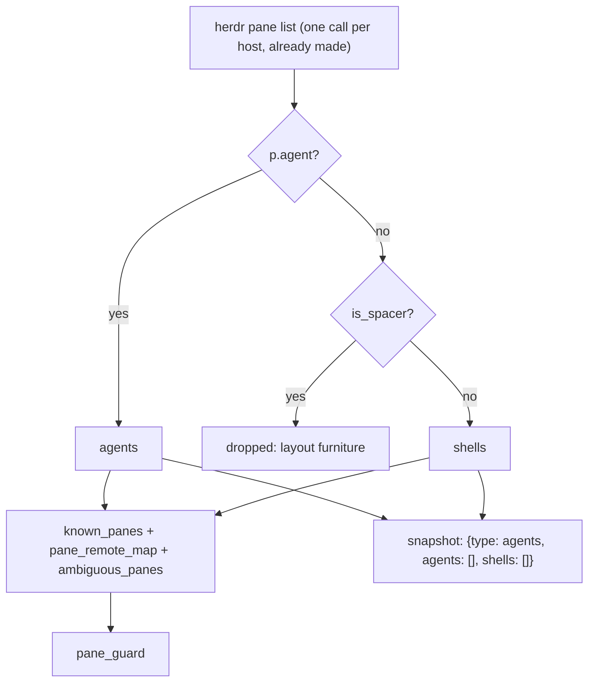

# Architecture — Terminal Mode

**Date:** 2026-08-09
**Scope:** `relay/herdr_relay.py`, `web/index.html`.
**Classification:** **Class B** — architectural extension, backward compatible. One additive key on
an existing message, one new env gate, one new poll-time set. No message type removed or altered.
**Status:** Decided. Supersedes the proposal of the same name (`e7e0ffc`); §10 of that draft is
answered and the answers are folded in below.
**Decisions:** `decision_log/2026-08-09_terminal_mode_trust_model.md`
**Spec:** `.workflow/03_specs/2026-08-09_terminal_mode_spec.md`
**Plans:** T1 — `.workflow/04_implementation_plans/2026-08-09_t1_terminal_read_only.md`

---

## 1. Problem

Every pane herdr knows about is reachable, but only panes *running an agent* are visible. So from a
phone there is no way to run `git status`, tail a log, restart a dev server, or look at why the
agent's build failed. The agent is remote-controllable and the machine it runs on is not.

## 2. Proof of Discovery

| Finding | Location | Consequence |
|---|---|---|
| **The poll already reads every pane and discards the shells.** `get_agents_from_host` runs `herdr pane list` and filters `if p.get("agent")` | `herdr_relay.py:284–306`, filter at 303 | Root cause, and the good news: shell discovery costs **zero additional subprocess calls**. Same call, same JSON, one fewer filter. The earlier draft's "second poll source" was wrong |
| `get_agents_from_host` has exactly two callers, both inside `get_all_agents` | `herdr_relay.py:309–313` | The parse can return both lists with a blast radius of one function |
| `known_panes` is populated only from that filtered snapshot | `herdr_relay.py:614–618` | A shell pane ID is not in the set |
| `pane_guard` refuses any pane not in `known_panes`, and any pane ID reported by more than one host | `herdr_relay.py:382–392` | **Every** write path — `respond`, `read_pane`, `send_keys`, `send_text`, `rename_pane`, `set_slot` — already refuses shell panes through one function. That is the design working, and it is also why §5 needs care: admitting a shell pane to `known_panes` opens *all six* at once |
| `ambiguous_pane_ids(agents)` takes a list and is called on the agent snapshot | `projects.py:137`, `herdr_relay.py:612–613` | Must be called on agents **and** shells. Shell pane IDs are per-server counters and collide identically |
| `annotate_agents(agents, projects)` matches on `cwd` + `host` and adds `project_id` | `projects.py:117–129` | Works unmodified on shell records. Project filtering comes free |
| `is_spacer(pane)` is `no agent AND label == "· spacer ·"`, and `plan_slot` may **close** a spacer | `start_agent.py:267–273, 325+` | Spacers are this feature's own layout furniture and are the one kind of pane the app closes on its own. §4.3 |
| A comment already states the snapshot drops panes with no agent | `herdr_relay.py:458` | Goes stale with this change; update it |
| `SAFE_RESPONSES` gates `respond`; `SAFE_KEYS` gates `send_keys`; `send_text` is capped at 4000 chars and has **no** gate | `herdr_relay.py:872, 915, 932–951` | `send_text` is safe today only because `pane_guard` limits its targets to agent panes. §5 |
| `section(title, color, list)` renders a header plus one `agentCard` per entry | `web/index.html:3282–3285` | The Terminals section is one more `section()` call with a different card function |
| `+ Start session` renders as a `chip-add` inside a `chip-strip` | `web/index.html:2297` | `+ New terminal` mirrors it |
| `navPush`/`navStep` are in the tested pure block and key on `pane_id` alone | `web/index.html`, `tests/test_pairs.js` | Session history spans agents and terminals with no change |
| `pairHealth`, `pairFor` and transfer all read the `agents` list | `web/index.html`, pairs spec §3 | Shells are never pair members. No change needed, and none should be made |

**Invariants to preserve**

- `pane_guard` stays the single choke point for pane addressability. Terminal mode extends what it
  knows and does not route around it.
- Ambiguous pane IDs are refused, never guessed. The ambiguity set covers every pane the relay will
  address, not just agent panes.
- Anything reaching argv is validated, never passed through.
- Every write is audited with the originating ip, device, and listener.
- Existing clients (iOS, macOS, Telegram, TUI) decode the current messages unchanged.
- `tests/test_pairs.js` extracts only the marked pure block. Do not move the markers.

## 3. Contract

> **A shell pane is a first-class pane and a second-class citizen. It is discovered by the same poll,
> guarded by the same `pane_guard`, and read by the same `read_pane` — and it never carries a status,
> never joins a pair, and never appears in an agent group.**

Binding for `relay/herdr_relay.py` and `web/index.html`. Consequences:

- Shell discovery adds no subprocess call. A design that needs a second `pane list` is wrong.
- Shells enter `known_panes`, `pane_remote_map`, and the ambiguity set together, or not at all. A
  pane the relay will address but has not checked for collision is the D6 bug.
- The wire never gives a shell a `status` or an `agent` field. Absence is the demarcation.
- The UI never renders a shell inside Blocked / Working / Done / Idle. Those four mean agent status;
  a shell has none, and an idle shell drawn as an idle agent is a lie.
- `respond` refuses shell panes permanently. `SAFE_RESPONSES` is a list of agent approval strings;
  sending "yes, single permission" to a shell is meaningless at best.
- Terminal mode off is not "shells hidden". It is **shells not discovered** — `known_panes` does not
  grow, and the guard behaves exactly as it does today.

## 4. Model

### 4.1 One parse, two lists



### 4.2 Wire

One additive key on the existing snapshot, not a second message. Agents and shells come from one
`pane list` and must not be able to arrive from different snapshots:

```json
{"type": "agents",
 "agents": [ … unchanged … ],
 "shells": [{"pane_id": "w8:p3", "label": "build watch",
             "cwd": "/Users/t/code/web", "project": "web", "host": "local", "remote": null,
             "workspace_id": "w8", "tab_id": "t2", "project_id": "web"}]}
```

No `status` and no `agent`. `remote` remains present because the existing agent snapshot already
sends it; shell records keep the same routing metadata shape. Swift's `Codable`, the Telegram bot,
and the TUI all ignore the additive `shells` key, so this is invisible to
every client that does not want it. Sent on connect and on every poll, exactly as `agents` is.

### 4.3 Spacers are excluded

A spacer is a shell at a prompt in a Project cwd — genuinely usable, and excluded anyway. `plan_slot`
may close a spacer to hand its columns back, and it is the only pane this application closes on its
own. Listing a pane the app may silently delete out from under a reader is worse than not listing it.

This yields a clean invariant that is worth more than the two panes it costs: **every pane in the
Terminals list is the user's, and nothing in the product will close it.**

### 4.4 Where a terminal comes from (T3)

`start_agent_exec` already creates a workspace, tab, or split at a Project cwd, with rollback, and
already reclaims a standing spacer. `open_terminal` is that flow minus the `agent start` step. Cwd
comes from Projects — the only cwd allowlist in the system — so there is no new path validation and
no second trust boundary to get wrong.

## 5. Security

Written plainly on purpose.

### 5.1 What was decided

The catalog design from the proposal draft is **dropped**. There is no `HERDR_COMMANDS_FILE`, no
`command_catalog`, no `run_command`, and no relay-side parameter validation. Shortcuts live in the
browser's `localStorage`, alongside `herdr_pairs`, and `send_text` is permitted to shell panes.

The reasoning, recorded in full in the decision log: a catalog is a security boundary only if raw
input is impossible. With raw input on — which is what was asked for — the catalog validates nothing
an attacker could not simply route around, and the whole apparatus becomes an expensive way to store
a list of strings that the client can already store for free.

**So state what this is without dressing it up:** with terminal mode on, anyone who can reach the
relay can run anything the herdr user can run. Not "can run approved commands" — anything.

### 5.2 The gate

`HERDR_ENABLE_TERMINAL=1`, **default off**, and off means undiscovered rather than hidden.

Deliberately **not** `HERDR_ENABLE_WRITE_EXT`. That gate's documented reasoning is agent process
creation; someone who enabled it to start sessions from their phone did not thereby consent to a
shell, and reusing it would silently widen a permission this repository spends hundreds of words
scoping narrowly.

**`HERDR_LAN_OPEN=1` does carry terminal mode.** This is the user's explicit decision, made with the
consequence stated: on an open LAN listener there is no token, so anything that can reach the port
gets a shell. It is logged in the decision log rather than argued again here. Two things keep it
from being an accident: terminal mode is opt-in and defaults off, and the relay logs a startup
warning naming both settings when they are on together.

The external listener is unchanged — it always requires a token, as it does for every other write.

### 5.3 Not proposed

No sudo handling, no credential entry, no per-command accounts, no sandboxing. All of it would be
theatre over a PTY the relay does not control. The honest boundary is: the operator decides whether
terminal mode is on and who can reach the port.

## 6. Client surface

**Agent list.** A `Terminals` section rendered by the existing `section()` helper after Idle and
before Recents, with its own card:

| `agentCard` | `terminalCard` |
|---|---|
| Status dot, coloured by status | `$` glyph, no status |
| Pair / Paired button | absent — pairs are agent-to-agent |
| `project · agent · name` title | label, monospace |
| cwd on line 2 | cwd on line 2, unchanged |

Section colour is its own var — not red/green/muted, which mean agent status. Terminals filter with
the active Project chip like agents do, via the `project_id` that `annotate_agents` already supplies.
`+ New terminal` is a `chip-add` mirroring `+ Start session` (T3).

**Terminal view.** The same shell: content region, ruler, wrap modes, CLS, slot control, Load more,
and session back/forward all work unchanged, because `read_pane` does not care what is in the pane.
The live header tab strip also includes terminals, so an open terminal remains visible as a first-class
navigation destination rather than disappearing from the current-pane chrome.

Demarcation is a 2px accent rule under the header plus a `$` before the title:

```
┌────────────────────────────────┐
│ ‹  $ herdr-remote     ⌄ ⟳ CLS  │
├════════════════════════════════┤ ← 2px accent
│ $ git status --short           │
│  M web/index.html              │
│ $                              │
├────────────────────────────────┤
│ [git status][make dev][tail…]  │
│ [^C] [^D] [↑] [↵]              │
└────────────────────────────────┘
```

Absent in a terminal: pair strip, transfer, approval quick actions, prompts dock.
Kept and promoted: the keys pad. **Ctrl+C is the most valuable control here** — it is the only way to
stop something you started.

No completion signal. herdr exposes no process lifetime, and the view will not pretend to know when
a command finished; it polls faster for a few seconds after a send and stops there.

## 7. Phasing

| Phase | Delivers | Requires |
|---|---|---|
| **T1** | Shell discovery, Terminals section, terminal view, `read_pane`, `send_keys`. **Read-only for text** | `HERDR_ENABLE_TERMINAL` |
| T2 | `send_text`, the shortcut grid, locally-stored shortcuts | — |
| T3 | `+ New terminal` in a Project cwd | + `HERDR_ENABLE_WRITE_EXT` |

**T1 is read-only by an explicit refusal, not by omission.** This is the subtle part: the moment a
shell pane enters `known_panes`, `pane_guard` stops refusing it and *all six* message types accept it
— including `send_text`. So T1 adds a one-line refusal of `send_text` on shell panes, which T2
deletes. One line built and one line deleted is cheaper than a tri-state gate, and it makes T1
genuinely read-only rather than read-only by UI convention.

T1 is independently useful — seeing what is running on the box, and Ctrl+C — and it proves the
cross-host ambiguity guard holds for shell panes before anything can write to one.

## 8. Risks

| Risk | Mitigation |
|---|---|
| Shell pane IDs collide across hosts exactly as agent IDs do | Feed the same `ambiguous_panes` set. Non-negotiable; §3 |
| Admitting shells to `known_panes` opens six message types at once | The T1 `send_text` refusal, and `respond` refusing shells permanently. Tested, not assumed |
| A shell pane ID is reused after the pane closes | The pairs spec's fingerprint problem one layer down. The open terminal view closes itself when its pane leaves the snapshot, rather than writing into a stranger |
| A long-running command with no output | The UI says it does not know, rather than inventing a completion signal herdr does not expose |
| Feature creep into a web terminal | §3's contract. A PTY stream is a different feature with a different classification |
