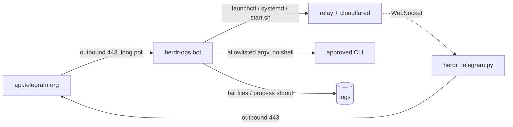

# Proposal — `herdr-ops`: a Telegram-driven operations server

**Status:** proposal, for discussion. Nothing frozen yet.
**Phase:** 2 (Architecture) · **Change class:** B (additive extension, no existing contract changes)
**Branch:** `feat/telegram-ops` (worktree `.claude/worktrees/feat+telegram-ops`, based on `origin/main`)

---

## 0. Problem statement and goal

**Problem.** Every way of reaching this machine today runs through the relay, and through the
Cloudflare tunnel in front of it. The web app needs `wss://`; the existing Telegram bot
(`herdr_telegram.py`) is a WebSocket client of the relay. So the failures that matter most are the
ones that take out the control surface at the same time:

| Failure | Today's outcome |
|---|---|
| Tunnel drops or `cloudflared` dies | Phone cannot reach the relay. The relay is fine; nobody can talk to it. |
| Temp tunnel restarts | New random hostname. The phone's stored URL is dead until someone reads the new one off the laptop's terminal. |
| Relay crashes or is wedged | The Telegram bot logs `Relay connection lost` forever. Every command is a relay round trip, so nothing works. |
| A supporting process needs a look or a kick | No remote path at all — you walk to the machine. |

The common shape: **the thing that broke is also the thing you would use to fix it.** Recovery
currently requires physical or SSH access to the host.

**Goal.** A second, independent control channel that stays up precisely when the first one is down,
and can put it back. Concretely, `herdr-ops` must:

1. **Reach the machine without any inbound path** — no tunnel, no open port, no hostname. Telegram
   long polling is outbound HTTPS, so it works from behind NAT and a dead tunnel alike.
2. **Survive what it is meant to repair** — no dependency on the relay, and never a child of the
   process tree it restarts.
3. **Restart the relay stack** via `start.sh` and hand back the fresh `wss://` link, so a dropped
   tunnel is one message and one tap, not a trip to the laptop.
4. **Manage the other long-running processes on this host** through a declarative registry, so
   adding one is config, not code.
5. **Show what is happening** — health at a glance, log tails, and live output streamed into a chat.
6. **Run a fixed set of approved CLI utilities** and relay their output, with the allowlist as a
   hard boundary rather than a convention.

**Non-goals.** Not a replacement for the web app or the agent bot; it does not read panes, approve
agents, or carry agent prose. Not a general remote shell. Not multi-host. Does not help when the
machine is offline, asleep, or powered down — that limit is inherent to running *on* the box.

---

## 1. Proof of Discovery

| Module | What it is today | Relevance |
|---|---|---|
| `relay/herdr_telegram.py` (898 L) | python-telegram-bot long-poller. **A client of the relay**: `relay_listener()` holds a WebSocket to `HERDR_RELAY` and every command (`/read`, `/send`, `/trust`, `/interrupt`, `/digest`) is a relay round trip. | Base to copy from — and the reason a second process is needed: when the relay is dead this bot can do nothing but log `Relay connection lost`. |
| `relay/herdr_relay.py` (2148 L) | The hub. Polls herdr, serves WS + HTTP. | The primary managed unit. Not modified by this proposal. |
| `relay/start.sh` (182 L) | Foreground launcher: reclaims ports, starts relay, starts `cloudflared`, prints/POSTs the `wss://` URL, `trap cleanup INT TERM EXIT`, ends in `wait $RELAY_PID`. | The restart mechanism. Its tunnel URL is currently only printed or webhooked — never persisted. |
| `relay/lib-ports.sh` | `reclaim_relay_port()` kills only argv matching `herdr_relay.py`; a foreign holder is a **hard error**. `stop_stale_tunnel()` matches on argv, never on the name `cloudflared`. | **Invariant to preserve:** never stop a process this project did not start. Ops restart must go *through* `start.sh`, not around it. |
| `relay/install-service.sh` | Writes launchd plists / systemd units: `com.herdr-remote.relay`, `.tunnel`, `.telegram`. | Preferred restart path (`launchctl kickstart -k`) and the supervision answer for the ops bot itself. |

**Patterns worth keeping from `herdr_telegram.py`:** `scrub()` (strips relay token + bot token from anything logged or sent), `filters.Chat(chat_id=…)` on every handler, short hashed `callback_data` tokens (Telegram's 64-byte cap), `AGENT_PAGE_SIZE` pagination, `httpx` logger silenced because the URL contains the bot token.

**Hard constraint found:** two processes long-polling **the same bot token** get `409 Conflict: terminated by other getUpdates request`. So `herdr-ops` either is a **second bot with its own token**, or it is merged into the existing bot process. This is the main fork in the road — see §7 Q1.

---

## 2. Why a separate process at all

The tunnel is not the only thing that fails; the relay is. The existing bot is downstream of the relay, so a relay crash silences the only remote control surface.



Properties that follow:

- **No inbound anything.** Long polling is an outbound HTTPS connection, so `herdr-ops` works with the tunnel down, the LAN listener firewalled, and no public hostname. It does *not* survive the machine being offline or asleep — state that limit plainly.
- **Zero dependency on the relay.** `herdr-ops` never opens the relay WebSocket. It touches the relay only as a supervised unit.
- **Separate blast radius.** This process runs approved binaries and controls services. That is a strictly higher privilege tier than "read a tmux pane", and it should not share a chat, a token, or an uptime with the agent bot.
- **Survives the relay's own restart.** It must never be a child of `start.sh`; killing the relay tree must not kill the thing that restarts it.

---

## 3. Component shape

One new file plus config; both live in `relay/` so the existing sibling-import style keeps working.

| Path | Marker | What |
|---|---|---|
| `relay/herdr_ops.py` | `[NEW]` | The bot. PEP 723 header, `python-telegram-bot>=21`, stdlib otherwise. |
| `relay/ops.example.json` | `[NEW]` | Service registry + CLI allowlist, committed as an example only. |
| `relay/tg_util.py` | `[NEW]` | ~40 lines shared by both bots: `scrub()`, message chunking, confirm keyboard, callback-token hashing. |
| `relay/herdr_telegram.py` | `[MODIFY]` | Import those four from `tg_util` instead of holding its own copies. No behaviour change. |
| `relay/start.sh` | `[MODIFY]` | Persist the tunnel URL to `$CONFIG_DIR/tunnel.url` next to the existing echo/webhook, so `/relay status` can report it after an unattended restart. |
| `relay/install-service.sh` | `[MODIFY]` | Add a `com.herdr-remote.ops` unit with `KeepAlive`. Supervision for the supervisor. |
| `tests/test_ops_allowlist.py` | `[NEW]` | Argument validation + registry parsing. The security-critical half. |

Config lives at `HERDR_OPS_CONFIG` (default `~/.config/herdr-remote/ops.json`) — **outside the repo**, because it names binaries this bot is allowed to execute.

```jsonc
{
  "services": {
    "relay": {
      "unit":     { "macos": "gui/$UID/com.herdr-remote.relay", "linux": "herdr-relay.service" },
      "fallback": ["relay/start.sh"],            // detached, only if no unit is installed
      "health":   { "tcp": 8375 },
      "log":      "~/Library/Logs/herdr-remote/relay.log"
    },
    "tunnel":   { "unit": {}, "health": { "pgrep": "cloudflared .*--url http://127.0.0.1:8375" } },
    "postgres": { "unit": {}, "health": { "tcp": 5432 } }
  },
  "commands": {
    "df":      { "argv": ["df", "-h"], "params": {} },
    "git-log": { "argv": ["git", "-C", "{repo}", "log", "--oneline", "-n", "{n}"],
                 "params": { "repo": { "enum": ["~/code/python/herdr-remote"] },
                             "n":    { "int": [1, 50] } } },
    "tests":   { "argv": [".venv313/bin/python", "-m", "unittest", "discover", "-s", "tests", "-t", "tests"],
                 "cwd": "~/code/python/herdr-remote", "timeout": 600, "stream": true }
  }
}
```

Everything the bot can do to the machine is one of those two tables. No dynamic discovery, no "run anything if the chat id matches".

---

## 4. Slash command library

Risk tier drives confirmation: **R** read-only (runs immediately), **W** state-changing (inline **Confirm / Cancel** button, 60 s expiry, single use).

| Command | Tier | Behaviour |
|---|---|---|
| `/help` | R | Generated from the registry — lists exactly what this install allows. |
| `/health` | R | One screen: each service up/down, relay port listening, tunnel process + current `wss://` URL and whether it answers, disk free, load, host uptime. The first thing you type when something feels wrong. |
| `/svc` | R | List registry services with state. |
| `/svc status <name>` | R | Unit state, pid, uptime, health probe, last 5 log lines. |
| `/svc start\|stop\|restart <name>` | W | Via launchd/systemd; detached fallback only when no unit exists. |
| `/relay restart` | W | Sugar for `/svc restart relay`; on success replies with the fresh `wss://` URL **and** the one-tap `HERDR_APP_URL?relay=…&token=…` deep link. This is the whole point of the server: tunnel died, one command, new link on the phone. |
| `/relay url` | R | Current tunnel URL + app link, no restart. |
| `/logs <name> [n]` | R | Last *n* (default 50, max 500) lines, chunked to Telegram's 4096-char limit. |
| `/tail <name>` | R | Live follow — see §5. |
| `/run <cmd> [args…]` | R/W | Allowlisted entry only; tier declared per entry. Output capped and chunked; `stream: true` entries tail live. |
| `/stop` | R | Ends the caller's active tail/stream. |
| `/ps` | R | Registry-owned processes only, never a full process table. |
| `/whoami` | R | Chat id + granted tier. How you discover your id on first run. |

Rejections are explicit: `/run rm` answers `not in allowlist`, never a shell error.

---

## 5. Streaming into a chat

Telegram has no stream. Two mechanisms, one buffer:

1. **Editing tail** (default) — one message, `editMessageText` at most every 3 s with the last ~30 lines. Reads as a live console, costs one message.
2. **Chunk append** — for output meant to be scrolled back, a new message per ~3500 chars.

Every stream is bounded by wall-clock (default 10 min), total bytes (default 256 KB), and one active stream per chat. It ends on `/stop`, on process exit, or on a cap, and always posts a final line saying which. ANSI escapes are stripped; the tail is fenced as `<pre>` so a phone renders it monospaced.

---

## 6. Security boundary

This process exists to execute things. The boundary is the whole design, so it is stated as rules, not prose:

1. **Chat allowlist is mandatory.** Unlike `herdr_telegram.py`, there is no "discovery mode" that answers everyone when `CHAT_ID` is unset — an unset allowlist refuses every command and prints your chat id so you can set it. Refusing to boot into an open state is the correct default for a process that runs binaries.
2. **Never `shell=True`.** `subprocess` with an argv list built from the registry template; parameters are substituted only as whole argv elements and only after passing their declared `enum` / `int` / `regex` validator.
3. **No free-form command path.** The bot cannot run a binary that is not a value in `commands`. There is no escape hatch, no `/exec`, no "admin mode".
4. **Confirmation on every W-tier action**, carried in `callback_data` as a hashed single-use token, expiring in 60 s.
5. **`scrub()` on every outbound message and log line.** Bot token, relay token, anything token-shaped. `httpx` logger stays at `WARNING`.
6. **Process control goes through the service manager or `start.sh`** — which means `lib-ports.sh`'s rule (only ever stop a process this project started; a foreign port holder is an error) is inherited rather than reimplemented. The ops bot never runs a bare `kill` on a pid it found by port.
7. **Rate limit** per chat (token bucket), so a stuck client cannot loop a restart.
8. **Config lives outside the repo** and is never echoed back in full.

---

## 7. Decisions (2026-08-18)

**D1 — Two bots, two chats.** `herdr-ops` gets its own `@BotFather` token (`HERDR_OPS_TG_TOKEN`) and its own chat (`HERDR_OPS_TG_CHAT_ID`). Sidesteps the `409 Conflict`, keeps machine control out of the agent chat, and lets ops outlive the agent bot.

**D2 — Registry ships relay + tunnel + dev processes.** No other local servers exist yet (confirmed 2026-08-18); the registry is a config file, so adding one later is an entry, not a code change. All four probe types (`tcp`, `pgrep`, `http`, `unit`) are still implemented because the config schema is the frozen contract — but only `tcp` and `pgrep` have a shipped example. Dev processes are registry entries with `stream: true`, so `/tail tests` works exactly like `/tail relay`.

**D3 — Detached `start.sh` is the first-class restart path.** The bot launches `start.sh` with `setsid` into its own process group, stdout/stderr to `$LOG_DIR/relay.log`, pid + pgid recorded in `$CONFIG_DIR/run/<service>.pid`. Stop is `SIGTERM` to the **process group** — which is what fires `start.sh`'s existing `trap cleanup INT TERM EXIT`, taking the tunnel down with the relay rather than orphaning it. Restart is stop-then-start; `start.sh`'s own `reclaim_relay_port()` remains the only thing that ever touches a port holder, so the "never kill a process this project did not start" invariant is inherited, not reimplemented. A launchd/systemd unit, when one exists, is an *alternative* backend selected by the registry's `unit` key — never a requirement.

  Two things follow and must be in the spec: (a) the ops bot must not die with its children nor kill them on its own restart — `setsid` plus pid/pgid files, and on boot it adopts what the pid files describe instead of starting a duplicate; (b) with `HERDR_TUNNEL_MODE=temp` every restart mints a new hostname, so persisting `tunnel.url` from `start.sh` is not a nicety — it is the only way `/relay restart` can answer with a working link.

**D4 — Strict separation from agents.** No relay WebSocket, ever. `/health` reports the relay as a service (port listening, pid, uptime, log tail), never as agents. Agent state stays the existing bot's job.

**D5 — Same machine only.** No SSH fan-out. `HERDR_REMOTES`-style multi-host is out of scope; revisit only if a second box actually appears.

---

## 8. Suggested path

1. ~~Settle Q1–Q5.~~ Done — see §7. Outstanding input: the list of other local servers (D2).
2. Freeze `ops.json` as the contract (§3), log the decision in `decision_log/`.
3. Spec: `03_specs/2026-08-18_telegram_ops_spec.md` — per-command inputs, outputs, failure modes, stream caps.
4. Plan: one implementation plan, file-by-file, plus `tests/test_ops_allowlist.py` and a manual E2E checklist (kill the relay, restart it from the phone, get the new `wss://` link back).
